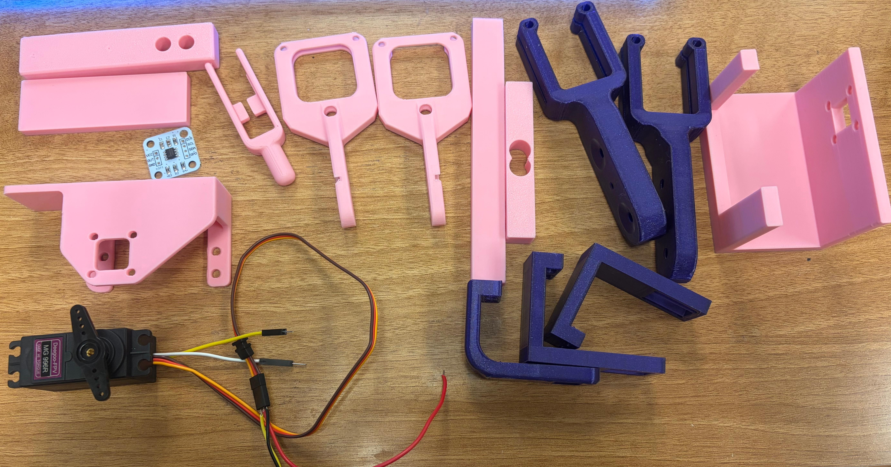
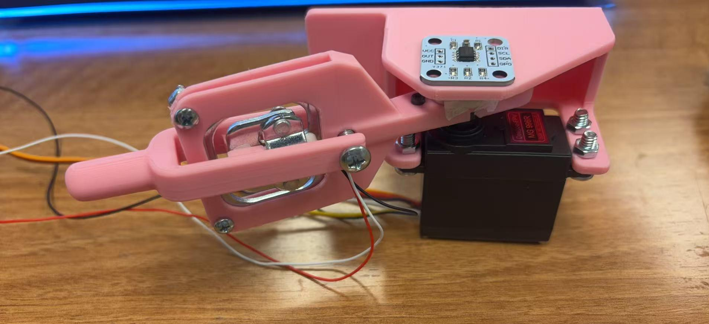

# HW15 – First Draft Mechanical Design of Haptic Paddle

## Overview
This assignment focuses on the first draft mechanical design of the haptic paddle system.  
The design integrates the main required hardware components into a printable and assembled prototype, including:

- RC servo
- servo horn / rotating mechanism
- load cell
- AS5600 magnetic encoder
- magnet placement for future angle sensing

The purpose of this version was to create an initial working mechanical assembly and identify issues for future iteration.

---

## CAD / Printed Parts
The first version of the mechanical parts was modeled in CAD and 3D printed.

### Printed parts / component layout

This figure shows the printed parts and the initial component integration concept.

---

## First Draft Assembly
After printing, the parts were assembled with the servo, load cell, and encoder mount.

### Assembled prototype

This first draft assembly includes:
- a mounted RC servo
- a printed arm structure
- load cell integration
- an AS5600 encoder mounting position
- a magnet placement concept aligned with the rotating servo mechanism

---

## Design Notes
Some important design goals in this version were:

- Mount the load cell securely within the printed frame
- Connect the printed arm to the servo-driven mechanism
- Create space for the AS5600 magnetic encoder above the rotating part
- Provide a location for the magnet near the encoder
- Build a first physical version to evaluate fit, spacing, and assembly issues

This version is a first draft, so further improvements are expected in:
- magnet alignment and encoder spacing
- fastening details
- wire routing
- mechanical rigidity
- overall packaging

---

## What Was Completed
For HW15, the following tasks were completed:

- CAD design of the first draft mechanical structure
- 3D printing of the main parts
- initial physical assembly of the haptic paddle structure
- integration of the servo, load cell, and encoder mounting concept
- photo documentation of the printed parts and assembled prototype

---

## Future Improvements
Future iterations will focus on:

- refining the AS5600 and magnet alignment
- improving structural stiffness
- reducing assembly complexity
- optimizing screw placement and part clearances
- preparing the mechanism for full sensing and control tests

---

## Files Included
- `README.md`
- `HW15_1.jpg`
- `HW15_2.jpg`

---
